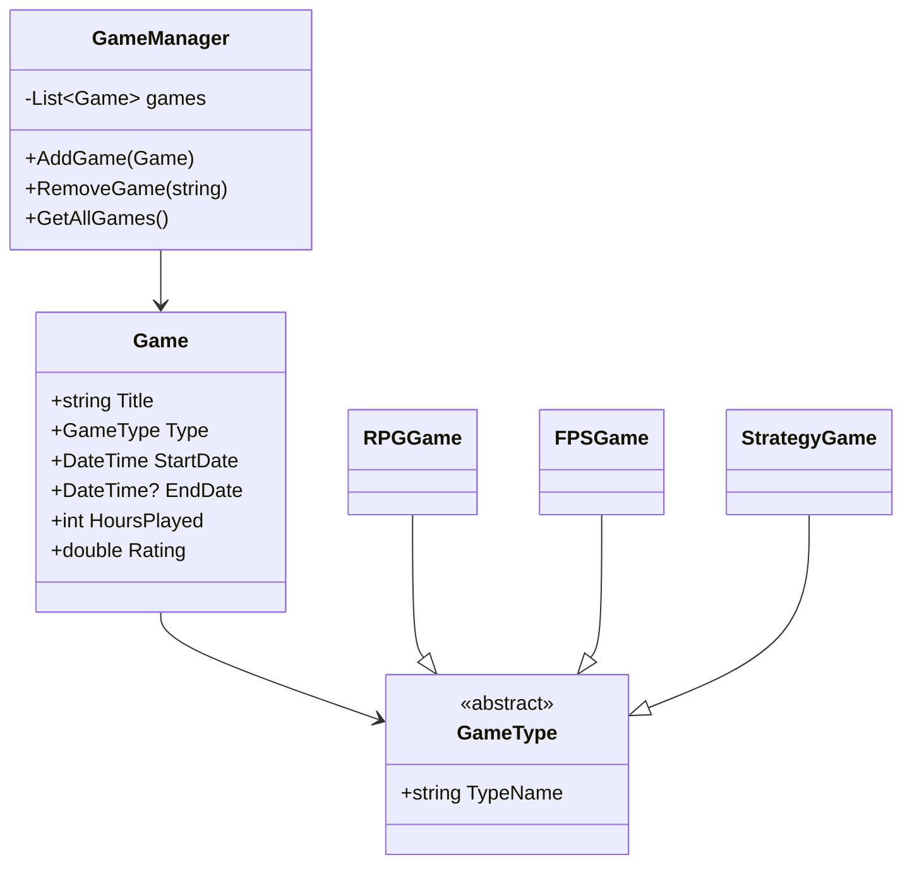

# Game Tracker Application

## Author
Mücahit Yıldız

## Introduction
Game Tracker is a desktop application designed to help users manage and track their gaming experiences. The application demonstrates advanced programming concepts including LINQ queries, delegates, events, and abstract classes. Built using Windows Forms and a universal library (GameTrackerLibrary).

## Detailed Features
1. Game Management
   - Add and remove games
   - Track completion status
   - Record playtime and ratings
   - Custom game type support
   - Start and end date tracking

2. Data Analysis
   - Filter games by type
   - Sort by rating
   - View most played game
   - Display total playtime hours
   - View game type distribution

3. Data Persistence
   - JSON serialization for data storage
   - Load/Save functionality
   - Data integrity checks

## Most Interesting Application Elements

### 1. Abstract Class Implementation
The application uses an abstraction system for game types:
```csharp
public abstract class GameType
{
    public abstract string TypeName { get; }
}
```

### 2. LINQ Usage
Example of LINQ implementation for statistics:
```csharp
public Dictionary<GameType, int> GetGameTypeStatistics()
{
    return games
        .Where(g => g.Type != null)
        .GroupBy(g => g.Type!)
        .ToDictionary(g => g.Key, g => g.Count());
}
```

### 3. Custom Events
Event handling for game completion:
```csharp
public delegate void GameCompletedHandler(Game game);
public event GameCompletedHandler? OnGameCompleted;
```

## Class Diagram


## Technical Details
1. Abstraction Layer
   - Abstract game type system
   - Game data management
   - Event handling system

2. Data Layer
   - JSON serialization
   - File operations
   - Data validation

3. UI Layer
   - Windows Forms implementation
   - User input handling
   - Data visualization

## How to Use
1. To add a game:
   - Enter the game title
   - Select existing type (RPG, FPS, Strategy) or enter a custom type
   - Choose start date
   - Set end date (optional)
   - Enter hours played
   - Give it a rating (0-10)
   - Click "Add Game" button

2. To view statistics:
   - Click "Playtime Stats" button
   - Click "Game Type Stats" button

3. To save/load games:
   - Use "Save" button to store your games
   - Use "Load" button to retrieve previous saves
   - You can load example data from "test.json" to try the application
